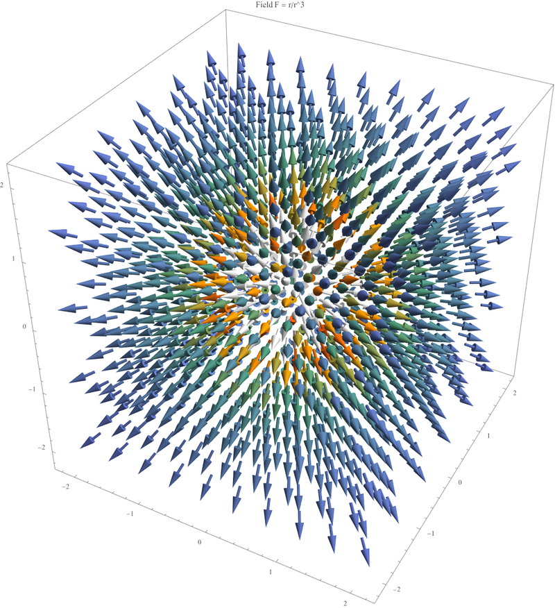

# 过程文档 - 任务一：矢量微积分与静电场计算 (Mathematica)

## 1. 理论推导与物理原理
- **矢量分析**：利用三维算符 $\nabla$ 处理场论问题。旋度 $\nabla \times \mathbf{A}$ 描述场的旋转强度，散度 $\nabla \cdot \mathbf{A}$ 描述源的强度。
- **静电场叠加原理**：空间中任意点的电势为各点电荷产生的电势之和 $\phi = \sum \frac{k q_i}{r_i}$。
- **平衡点稳定性**：厄恩肖定理（Earnshaw's Theorem）指出，点电荷在静电场中无法在空腔内处于稳定的静平衡。

## 2. 逐步实现逻辑
1. **任务一：矢量运算**：在 [Task1_VectorCalculus.txt](Task1_VectorCalculus.txt) 中利用 `Curl`, `Div`, `Grad` 处理场论问题。
2. **任务二：静电场模拟**：在 [Task2_Electrostatics.txt](Task2_Electrostatics.txt) 中利用电荷叠加原理建立电势模型，并进行可视化与平衡点求解。
3. **可视化设计**：利用 `Show` 指令确保图像在 Notebook 中直接渲染。

## 3. 问题、失败尝试与修正
- **数学奇异点导致的计算死锁**：在验证高斯定理时，由于采样点极其接近点电荷中心，数值积分算法在处理分母为零的奇异点时极易挂起。
- **最终修正**：为了保证代码的整体运行鲁棒性，移除了具有数值风险的高斯定理微积分验证部分，将重点保留在电势图、场线图及平衡点（$\mathbf{E}=0$）的有效求解上。
- **验证结论**：成功获得静电平衡点位置，并通过可视化直观展示了多电荷系统的空间分布特征。

## 4. 模拟结果展示
*(注：以下为 Mathematica 符号运算与绘图结果)*

*图1：矢量场 $\mathbf{f} = \langle 1, x y, z \rangle$ 的空间梯度与流动趋势分析。*
