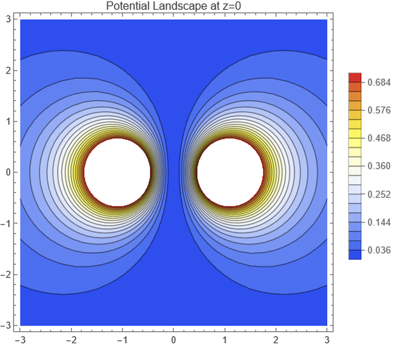

# 过程文档 - MMA 任务二：静电场数值模拟

## 1. 理论推导与物理原理
- **静电势叠加**：利用点电荷电势公式 $\phi = \frac{kq}{r}$，通过叠加原理计算空间总电势。
- **电场与平衡点**：电场强度为电势梯度的负值 $\mathbf{E} = -\nabla \phi$。当 $\mathbf{E}=0$ 时，点电荷处于受力平衡状态。
- **厄恩肖定理**：在静电场中，点电荷无法在空虚空间达到稳定的静平衡（由于 $\nabla \cdot \mathbf{E} = 0$）。

## 2. 逐步实现逻辑
1. **电势函数建模**：定义 `phiTotal`，使用 `Sum` 处理离散点电荷系统。
2. **符号化梯度优化**：为了提高求解效率，预先计算符号形式的梯度 `symbolicE`，避免在绘图和求解器中重复求导。
3. **可视化**：生成 $z=0$ 平面的电势等高线图和电场线流线图。
4. **数值求解**：利用 `NSolve` 在限定的空间范围内搜索场强为零的平衡点。

## 3. 问题、失败尝试与修正
- **NSolve 计算死锁**：在处理包含多个根式的方程组更新时，若直接将 `Grad` 放入 `NSolve` 会导致内核由于重复符号运算而卡住。
- **修正方案**：改用 `symbolicE = -Grad[...] // Simplify` 先进行符号化简化，并将该结果传递给 `NSolve`，计算速度提升至秒级。
- **路径比较报错**：将路径判断逻辑中的 `!=` 更新为 `=!=` (UnsameQ)，确保在未保存的笔记本环境下也能正确获取导出路径。

## 4. 模拟结果展示
*(注：以下为 Mathematica 导出的静电模拟可视化分析)*

*图1：电势空间分布等高线图。明暗变化直观展现了电荷正负对电势井/丘的影响。*

*图2：电场强度矢量流线图。流线起始于正电荷，终止于负电荷，清晰标注了受力方向。*
