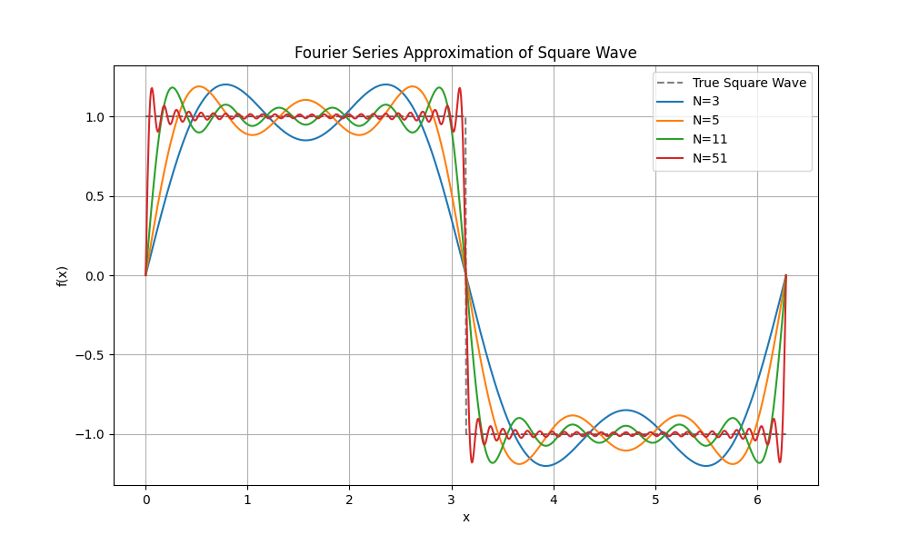
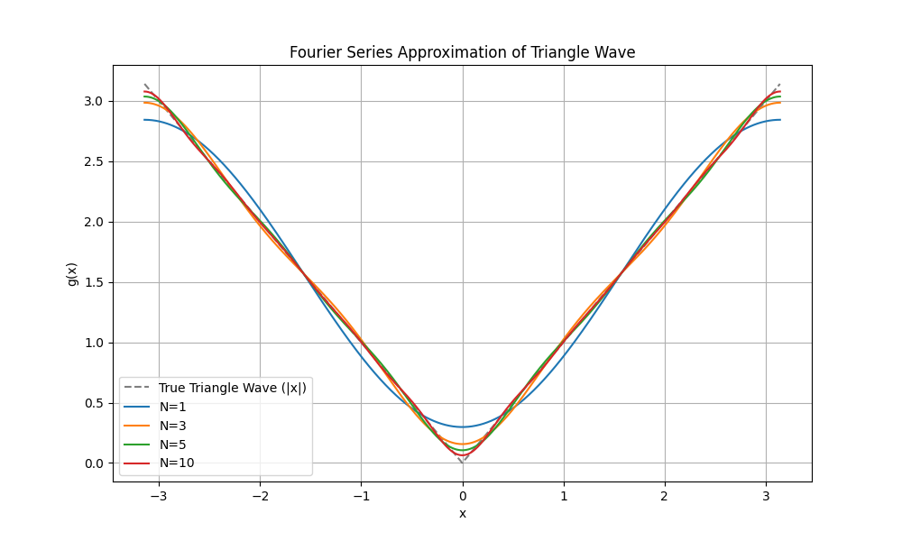

# 过程文档 - 任务二：傅里叶级数与波形分析 (Python)

## 1. 理论推导与物理原理
- **基频与谐波**：周期信号可展开为一系列正弦/余弦分量的叠加。间断点处的收敛性由吉布斯现象描述。
- **FFT 原理**：将时域信号转换为频域，通过振幅峰值识别信号的频率成分。

## 2. 逐步实现逻辑
1. 使用 NumPy 实现了方波和三角波的级数求和函数。
2. 利用 Matplotlib对比了不同采样项数 $N$ 对拟合精度的影响。
3. 对合成信号进行快速傅里叶变换（FFT），验证频率成分。

## 3. 问题、失败尝试与修正
- **混叠现象**：初始采样频率过低。为准确捕捉 11Hz 成分及高阶谐波，将采样率提升至 100Hz。
- **收敛速度对比**：通过实验观察到三角波（连续）比方波（不连续）收敛快得多，验证了级数系数衰减速率（$1/n^2$ vs $1/n$）的差异。
- **输出结果图展示**：

*图1：方波的傅里叶级数逼近。随着项目数 $N$ 增加，信号逐渐接近方波，但跳变处可见吉布斯现象带来的过冲。*

*图2：三角波的傅里叶级数逼近。由于信号连续，其逼近速度明显快于方波，无明显震荡。*

*图3：利用 FFT 得到的频谱图。精确捕捉到了合成信号中的各频率分量（如 2Hz, 4Hz 等谐波）。*

- **吉布斯现象观察**：在 $N=51$ 时，虽然主体部分更接近方波，但跳变沿的过冲依然显著，这验证了理论预测。
