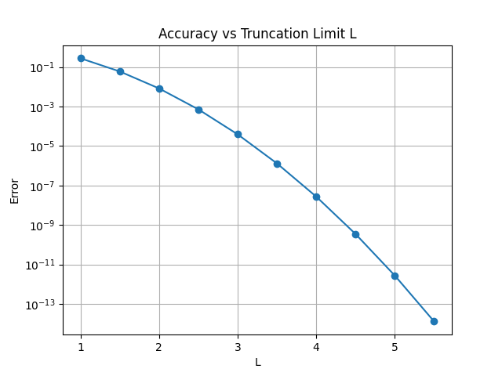
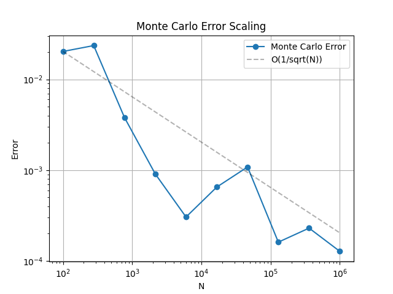

# 过程文档 - 任务三：数值积分与误差分析 (Python)

## 1. 理论推导与物理原理
- **代数精度**：梯形法依靠线性插值（2阶），辛普森法依靠二次插值（4阶）。
- **坐标变换**：对于无穷积分区间，利用反向函数变换（如 $t = x/\sqrt{1-x^2}$）将无限映射为有限。

## 2. 逐步实现逻辑
1. 实现基础积分函数，利用 $\log-\log$ 图分析误差缩放规律。
2. 实现截断法与坐标变换法计算高斯积分。
3. 编写蒙特卡洛积分脚本，利用随机采样估算函数值。

## 3. 问题、失败尝试与修正
- **边界奇异点**：坐标变换在映射边界存在分母为零的风险。通过 `np.clip` 或微调区间上限（如 0.999）确保数值稳定性。
- **输出结果图展示**：

*图1：积分精度随步长 $h$ 的演化。辛普森法的斜率明显高于梯形法，证明了其更高阶的收敛特性。*

*图2：直接截断法计算广义积分的误差曲线。展示了截断半径 $R$ 对精度的指数级贡献。*

*图3：蒙特卡洛积分的统计特征。误差散点图展现了典型的 $1/\sqrt{N}$ 收敛趋势。*

- **统计波动**：蒙特卡洛法在 $N$ 较小时误差很大，且不具有单调性。通过绘制误差分布验证了其收敛速度符合 $1/\sqrt{N}$。
