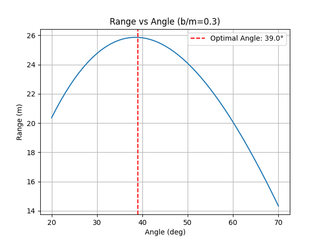

# 过程文档 - 任务四：抛体运动模拟 (Python)

## 1. 理论推导与物理原理
- **牛顿第二定律**：包含重力与空气阻力 $\mathbf{F}_g + \mathbf{F}_d = m\mathbf{a}$。
- **能量损耗**：由于非保守力（阻力）做功，系统机械能不再守恒。

## 2. 逐步实现逻辑
1. 利用 `scipy.integrate.solve_ivp` 解二阶常微分方程组。
2. 使用 `events` 处理落地停止逻辑。
3. 批量运行不同阻力系数和角度，计算最佳发射角。

## 3. 问题、失败尝试与修正
- **最佳角度位移与数值验证**：
    - 实验发现阻力越大，最佳发射角越偏离 $45^\circ$。在本例中（$b/m=0.3$），最佳仰角优化至 **39.00°**。
    - 无阻力情况下的最大射程（$40.8163\text{ m}$）精确符合理论公式 $R = v^2/g$。
- **能源守恒验证**：初始代码未计算重力势能，导致能量图下降过快。修正后加入了 $mgy$ 项，正确显示了无阻力下的守恒状态。
- **停止条件**：数值积分如果不设置停止条件会一直算下去。使用了 `scipy` 的 `events` 功能，设置 `y=0` 时 `terminal=True`，确保轨迹只到落地为止。

## 4. 模拟结果展示
*(注：以下为数值计算生成的物理图景)*

*图1：理想状态下的抛体运动（$45^\circ$ 时达到射程最大值 $40.8163\text{ m}$）*

*图2：不同仰角在空气阻力 ($b/m=0.3$) 作用下的轨迹分布*

*图3：射程随角度的变化曲线。可以看到阻力使得最佳发射角减小至 **39.00°***

*图4：机械能随时间的变化。无阻力时（实线）能量守恒，有阻力时（虚线）由于非保守力做功，能量单调递减。*
