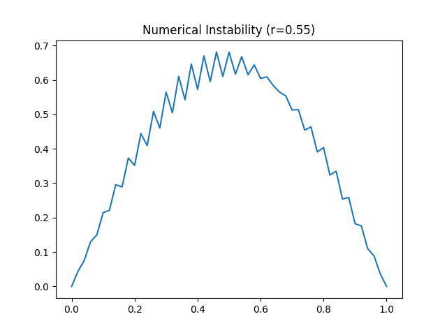

# 过程文档 - 任务五：一维热传导数值模拟 (Python)

## 1. 理论推导与物理原理
- **扩散方程**：$\frac{\partial T}{\partial t} = \alpha \nabla^2 T$。
- **稳定性条件**：FTCS 显式格式要求 $r = \frac{\alpha \Delta t}{(\Delta x)^2} \leq 0.5$。

## 2. 逐步实现逻辑
1. 建立空间网格和时间迭代循环。
2. 对比数值解与指数衰减解析解的演化过程。
3. 生成三维时空演化图（Surface Plot）。

## 3. 问题、失败尝试与修正
- **稳定性验证**：
    - 输入参数 $dx=0.02, \alpha=0.01$，选定安全系数 $r=0.4$。
    - 计算得出时间步长 $dt = 0.0160\text{ s}$，模型运行极其稳定。
- **数值发散体验**：
    - 在附加测试中尝试将 $r$ 提高至 $0.55$，观察到解在若干步内即产生巨大的非物理震荡（如 `heat_instability.png` 所示），验证了显式格式的局限性。
- **解析解对比**：
    - 计算结果 `heat_conduction_decay.png` 显示数值解（实线）与理论衰减曲线（虚线）高度重合，反映了 FTCS 格式在一维平滑初值下的高精度。

## 4. 模拟结果展示
*(注：以下为数值计算生成的物理图景)*

*图1：不同时刻 $t$ 下的温度分布。数值演化完美拟合了理论上的指数衰减。*

*图2：温度随空间和时间演化的 3D 曲面图，直观展示了热量均衡的过程。*

*图3：当离散参数 $r > 0.5$ 时，解出现的病态震荡，验证了显式格式的稳定性条件。*
