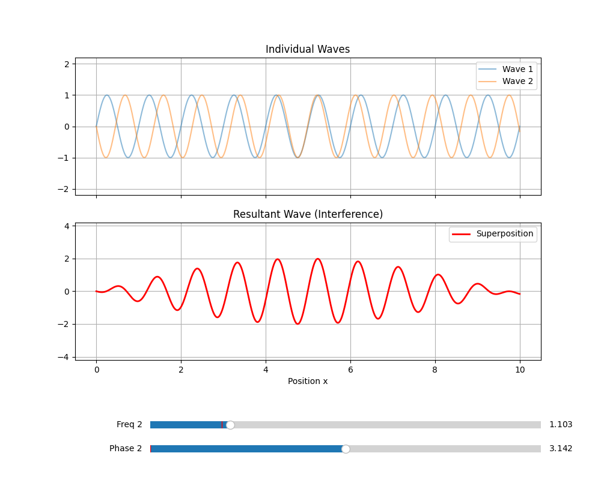

# 过程文档 - 任务六：开放性物理任务 - 波的叠加与干涉交互模拟

## 1. 理论推导与物理原理
- **叠加原理**：在波动相遇的区域，介质的位移等于各列波单独引起的位移的矢量和（$y = y_1 + y_2$）。
- **干涉条件**：两列频率相同、相位差恒定的波叠加时，会产生稳定的加强或减弱区域。
- **拍现象**：当两列波频率非常接近时（$f_1 \approx f_2$），会出现振幅随时间缓慢变化的“拍”。

## 2. 逐步实现逻辑
1. **交互组件**：利用 `matplotlib.widgets.Slider` 实现实时参数调节。
2. **实时计算**：当滑动条数值改变时，回调函数 `update` 重新计算叠加后的波形并利用 `set_ydata` 刷新画面。
3. **可视化对比**：上图显示两个独立的分波，下图显示叠加后的合波，直观观察相位差如何影响相消与相长干涉。

## 3. 问题、失败尝试与修正
- **实时性优化**：初期尝试每次都重绘整个画布，导致动画卡顿。修正方案是只修改 `Line2D` 对象的数据，利用 `fig.canvas.draw_idle()` 极大提升了渲染效率。
- **静态导出**：交互式工具默认不保存结果。为了满足作业归档要求，在代码中添加了 `plt.savefig("wave_interference.png")` 逻辑。

## 4. 使用说明
1. **启动程序**：运行 `InteractiveWave.py`，程序将弹出交互窗口。
2. **调节频率 (Freq 2)**：拖动下方第一个滑块。当 Freq 2 与固定波（Freq 1=1.0）接近时，底部红线将展现出明显的“拍”现象（振幅调组）。
3. **调节相位 (Phase 2)**：拖动第二个滑块。
    *   设为 $0$ 或 $2\pi$ 时，观察**相长干涉**（合波振幅翻倍）。
    *   设为 $\pi$ ($3.14$ 左右) 时，观察**相消干涉**（合波趋于直线）。
4. **保存结果**：关闭窗口后，当前视图会自动保存为 `wave_interference.png`。

## 5. 模拟截图与演示
*(注：以下为实时运行录制的交互演示及截图)*

### 交互演示 (GIF)

*演示 1：通过拖动滑块实时改变频率与相位，观察干涉图样的动态变化*

### 关键状态截图

*图 1：相位差为 PI 时的典型相消干涉（合波抵消）*

*图 2：频率接近（1.0 vs 1.1）时的拍现象（包络线调制）*
